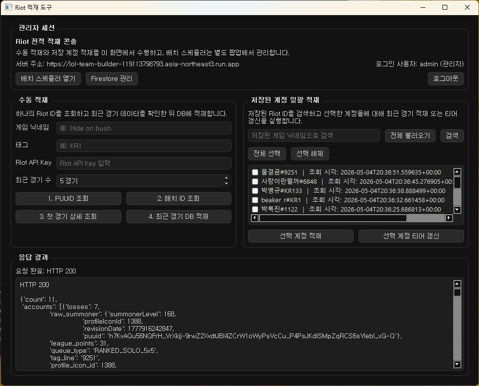
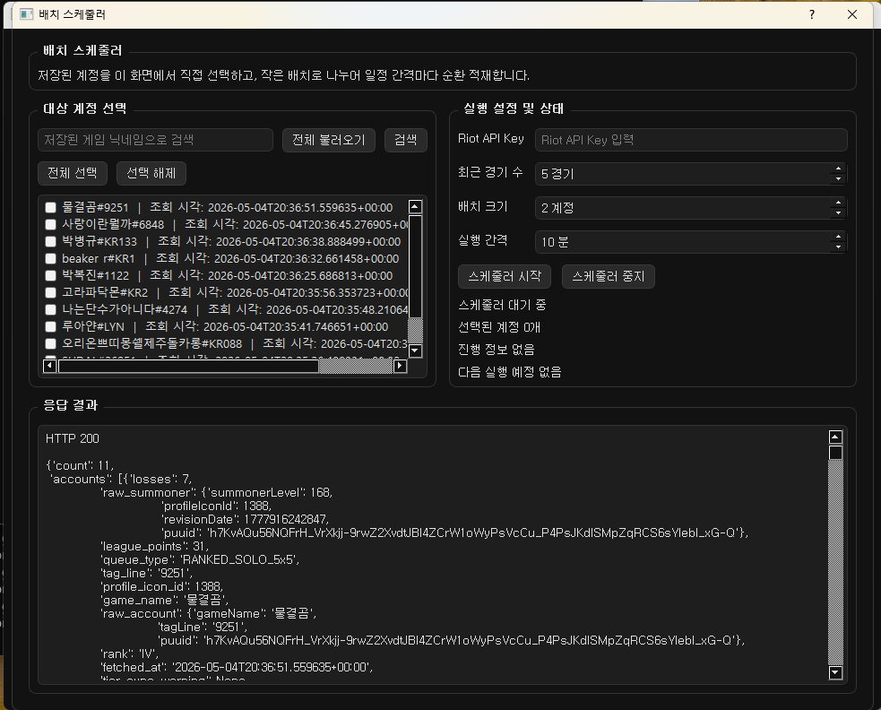
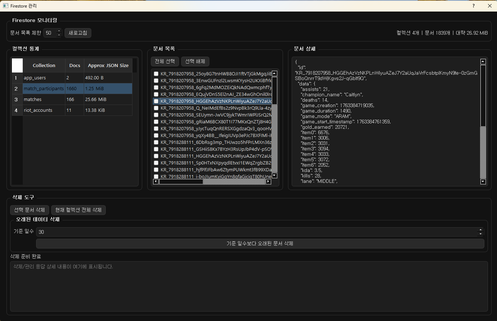
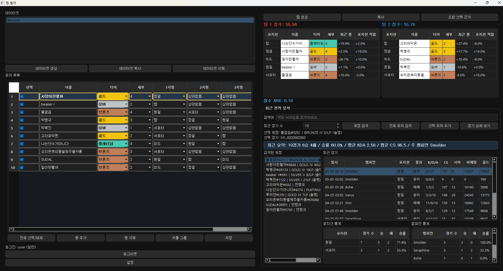
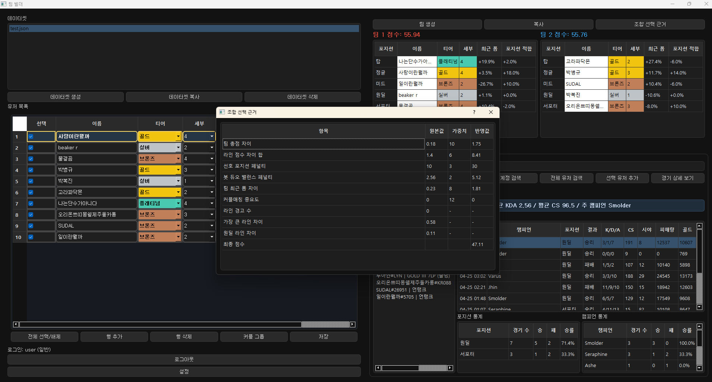
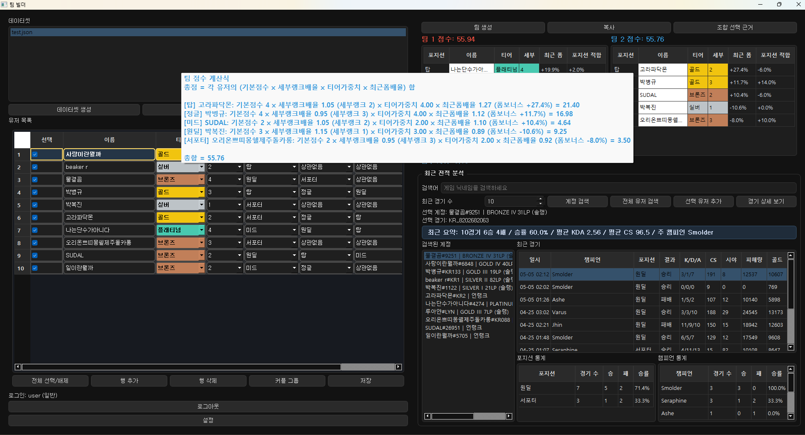
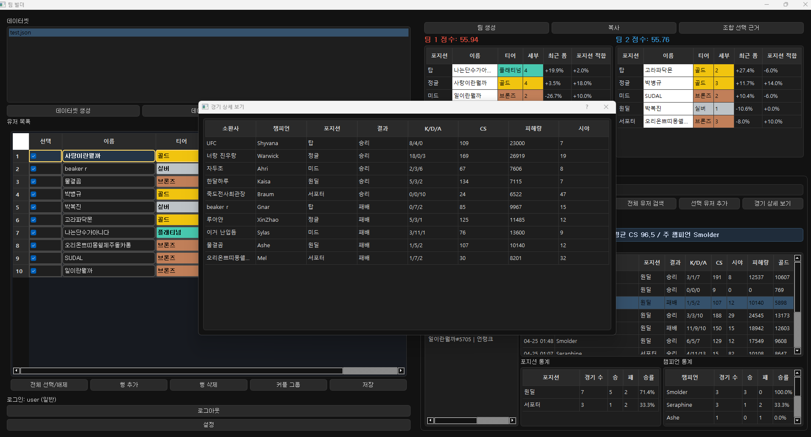

# LOL Team Builder

> **This project isn't endorsed by Riot Games and doesn't reflect the views or opinions of Riot Games or anyone officially involved in producing or managing Riot Games properties.**
>
> **Riot Games and all associated properties are trademarks or registered trademarks of Riot Games, Inc.**

[Latest Build Download](https://github.com/ojwojwojw/lol_team_builder/releases/latest)  
[Korean README](README.md)

LOL Team Builder is a desktop-first League of Legends team balancing application designed for small private groups playing custom games and in-house matches.

## Overview

The core value of the product is a team formation support logic executed locally inside a PyQt5 desktop client.  
The backend does not replace the main logic. Instead, it provides supporting data such as stored Riot accounts, recent match summaries, and match detail records.

This project is not a public website product. It is a PyQt5 desktop application backed by a small cloud API.

This project is designed for a small private group that regularly runs custom games.

The admin role is restricted and used only for controlled data ingestion and system operations within this private group. It is not available to general users.

## Riot API Key Handling

The Riot API key is never exposed to end users and is not part of the normal user workflow.

It is managed only through backend server environment variables.

The Riot API key is never entered, stored, or handled within the client application.

All Riot API requests are executed exclusively through the backend (FastAPI) service.  
The desktop client does not communicate directly with the Riot API.

In deployment, the API key is securely managed through server-side environment variables and GCP Secret Manager.

User authentication sessions are handled with JWT-based access tokens issued by the backend.

## What the Product Does

- Helps small groups create fair custom teams  
- Lets users search stored player accounts  
- Shows recent match summaries and recent match information  
- Adds searched players into a local team-building dataset  
- Generates reasonably balanced teams for private matches  
- Supports team organization and personal gameplay review within a private group  

## Operational and Data Handling Approach

- The Riot API key is not exposed to end users and is never persisted in the client application  
- All Riot API requests are executed only by the backend service  
- The desktop client does not communicate directly with the Riot API  
- Only the necessary data is fetched and delivered through authenticated backend APIs  

- Data ingestion using the Riot API is strictly restricted to the admin role and is performed only for accounts belonging to the private group  
- General users do not have access to any data ingestion or Riot API interaction features  

- Data ingestion is performed in controlled, small batches with reuse of previously fetched data to minimize unnecessary API requests  

- Player-related data such as recent matches, win rate, and KDA are used only as reference inputs for team organization and self-review  
- These statistics are not used to evaluate, rank, or judge players  

## Policy Compliance

- This application does not attempt to replicate or replace Riot’s official ranking systems such as Ranked Leagues, MMR, or ELO  
- It does not provide any public ranking, evaluation, or player judgment features  

- Any internal calculations or scoring mechanisms are used solely for team organization purposes  
- These calculations are not intended to evaluate or rank players  

- The goal is to help small private groups organize fair teams, not to publicly rank, shame, or judge players  

## Scope of the Project

- This project is intended only for a small private group and is not a public-facing service  
- It is a desktop-based utility tool for in-house matches among friends  

- Access is restricted to invited users with individually assigned login credentials (ID and password)  

- The database collects Riot account and match data only for users within this private group  
- No data outside the intended group is collected or processed  

- The application does not provide alternative systems for reporting, evaluating, or ranking other players  

## Data Usage and Rate Limiting

- Riot API data is collected in controlled, small batches with rate-limit awareness  
- Previously fetched data is stored and reused to reduce unnecessary repeated requests  
- All data access is limited to documented Riot API endpoints and official developer tools  

## Disclaimer

This project is not endorsed by or affiliated with Riot Games.

It does not use official Riot Games logos or present itself as an approved Riot partner product.

## Why It Exists

Many small groups running custom games still create teams manually by guessing player strength.

This project is designed to make that process more structured, fair, and repeatable.

Instead of relying only on rank, the application can use:

- preferred roles  
- recent match information  
- recent win rate  
- recent KDA  
- stored player metadata  

## Product Format

This is a desktop application built with PyQt5.

The cloud backend is used only to:

- authenticate app users  
- read stored Riot account information  
- read recent match summaries  
- read match detail data  

The main team-building workflow happens entirely inside the desktop client.

## Tech Stack

### Desktop Client
- Python 3.12  
- PyQt5  
- QSS themes  

### Core Logic
- client/domain/team_builder.py  

### Backend
- FastAPI  
- PyJWT  
- google-cloud-firestore  

### Infrastructure
- Google Cloud Run  
- Cloud Firestore  

## System Architecture

### 1. Main Desktop Client
- This is the main application directly launched by users.
- It handles local dataset editing, stored account search, recent match lookup, team generation, and result copying.
- The actual team-balancing logic runs locally inside the desktop client.

### 2. Team Builder Domain Logic
- This is the core logic of the project.
- It calculates team balance using tier, sub-tier, role preference, and recent match form.

### 3. Cloud Run API
- User authentication
- Stored Riot account lookup
- Recent match summary lookup
- Match detail lookup
- JWT-based access token issuance and verification
- Authorization checks for admin-only operations

This backend is a supporting layer for the desktop application.  
It does not replace the local team-building workflow.

### 4. Cloud Firestore
- App user accounts
- Stored Riot account metadata
- Raw match detail records
- Participant index data for recent match lookups

### 5. Riot Data Ingestion
- Riot data ingestion is handled only in the admin flow.
- It is not part of the general user-facing team builder workflow.
- The admin uses server-configured Riot API environment variables to store recent matches, account metadata, and tier information in Firestore.
- This operation is designed for a small private group, using controlled batch execution and reuse of existing data to reduce repeated requests.
- These admin operations are available only to the developer's restricted `admin` account.

## Screen Reference

### 1. Riot Loader Main Screen

- This is the admin operations console for authenticated admin sessions, manual ingestion, bulk ingestion from stored accounts, and response monitoring.
- The left side is used for manual ingestion by Riot ID, while the right side is used for bulk ingestion or tier refresh from stored accounts.
- The Riot API key is not shown in the UI and is managed only through server-side environment variables.

### 2. Batch Scheduler Screen

- This screen is used to ingest stored accounts sequentially in small batch units.
- Admins can adjust recent match count, batch size, and execution interval for longer-running ingestion tasks.
- This screen also works without any API key input field because ingestion requests rely on server-side environment variables.

### 3. Firestore Admin Screen

- This is a Firestore monitoring view for collection statistics, document lists, raw JSON inspection, and deletion tools.
- It is used to verify ingestion results and clean up older data when needed.
- Riot API key management is separated from this screen and remains server-side only.

### 4. Main Team Builder Workspace

- This is the main working screen where dataset editing, user selection, account lookup, recent match analysis, and team generation come together.
- The left side focuses on the local team dataset, the right side focuses on lookup and analysis, and the top area shows generated team results.

### 5. Combination Rationale Popup

- This popup explains why a generated team combination was selected.
- It shows score differences, lane balance differences, role penalties, and recent-form adjustments.

### 6. Team Score Formula Popup

- This popup shows how each player's base score, tier multiplier, role weight, and recent-form multiplier are combined.
- It helps both users and the admin understand and validate the balancing logic.

### 7. Match Detail Popup

- This popup shows participant-level detail for a selected recent match.
- Users can review summoner name, champion, role, win/loss, KDA, CS, damage, and vision values in one place.

## Reviewer Note

- This product is a desktop utility application  
- It is not a public consumer-facing service  
- The main functionality is executed locally in the client  
- Riot data is used only to support team organization and player self-review  
- The backend is a supporting data service, not the primary product surface  
- The application is intended only for small private groups running custom games  
